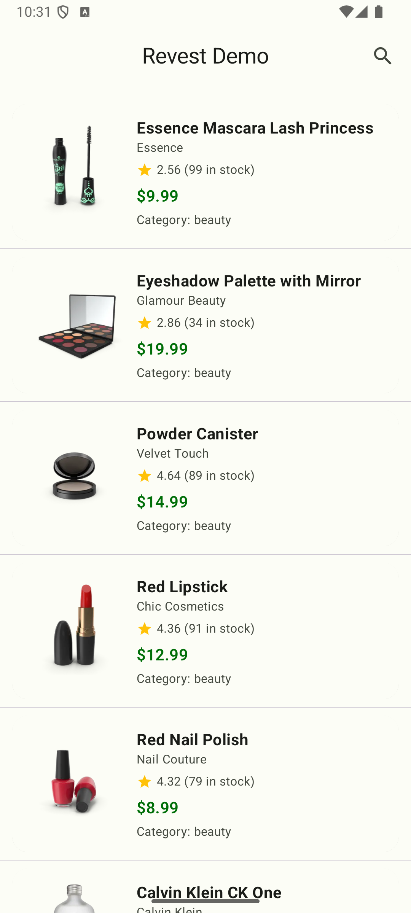
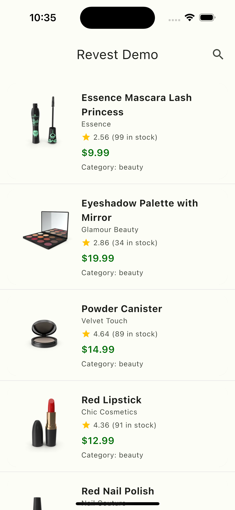
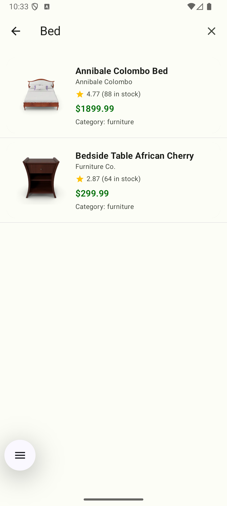
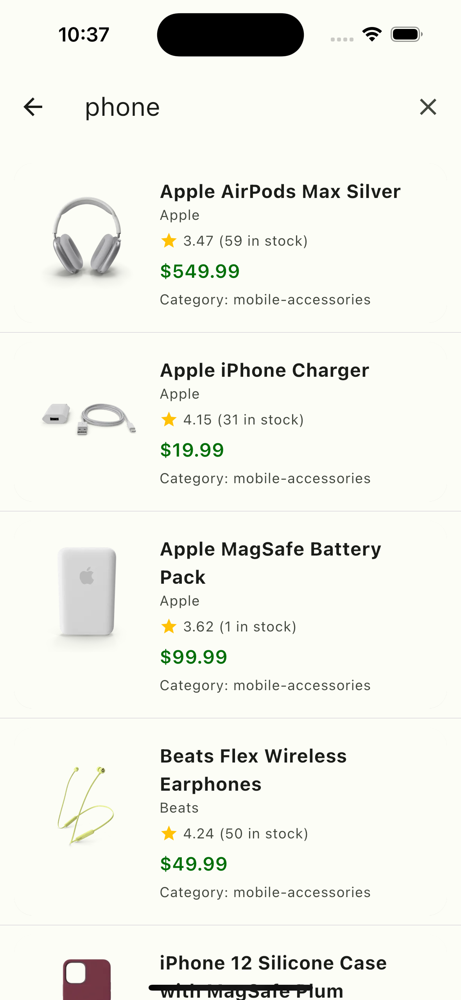
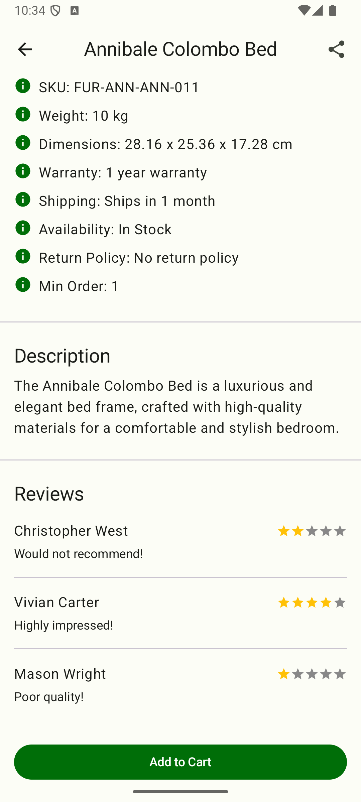
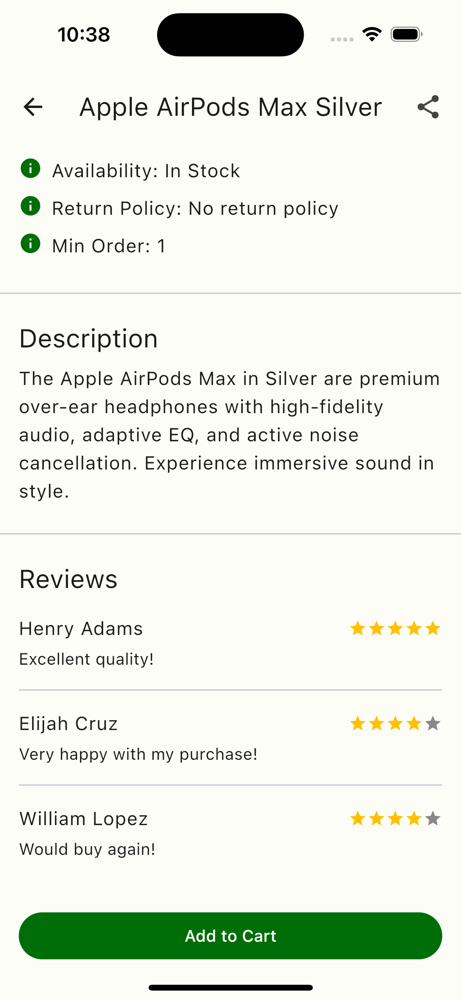

# Revest Demo

 

Kotlin + Compose multiplatform project that showcases a modern, clean, and professional product catalog app. It utilizes the [dummyjson.com](https://dummyjson.com) API to fetch product data and presents it in a visually appealing manner. The app features a search bar, a product detail screen, and a paginated list of products. The user interface adheres to Material3 design guidelines, providing a modern and intuitive way to discover and engage with product content.

## Features

- Data and Domain layers implemented using [Kotlin Multiplatform](https://kotlinlang.org/docs/multiplatform.html)
- Presentation layer implemented using [Compose Multiplatform](https://www.jetbrains.com/lp/compose-multiplatform/) and [Material 3](https://m3.material.io/) design guidelines
- Supports [Dynamic Colors](https://m3.material.io/styles/color/dynamic-color/overview) schema
- Adaptive launcher [Themed Icon](https://developer.android.com/develop/ui/views/launch/icon_design_adaptive) (for Android 13+)
- Navigation based on [Jetpack Navigation](https://developer.android.com/jetpack/androidx/releases/navigation)
- Uses [dummyjson.com](https://dummyjson.com) open API for product data
- Infinite lists (pagination) for a seamless browsing experience
- Data flow implemented using [Kotlin Coroutines Flow](https://kotlinlang.org/api/kotlinx.coroutines/kotlinx-coroutines-core/kotlinx.coroutines.flow/-flow/)
- Multiplatform unit tests
- Debounced search functionality with animations
- Product detail screen with a swipeable image carousel

## Project Structure

The project is organized into three main multiplatform modules:

- **`:shared-domain`**: Contains the core business logic, including use cases and data models.
- **`:shared-data`**: Implements the data layer, including repositories and network services that fetch data from the API.
- **`:shared-presentation`**: Contains the presentation layer, including ViewModels and the UI created with Compose Multiplatform.

### Key Versions

- **Kotlin**: 2.2.21
- **Compose Multiplatform**: 1.9.1
- **Ktor**: 3.3.1
- **Koin**: 4.1.1
- **Coroutines**: 1.10.2
- **Android Gradle Plugin**: 8.13.0
- **Android Studio Narwhal 4 Feature Drop**: Build #AI-251.27812.49.2514.14217341, built on October 6, 2025

## Testing

The project uses a modern testing stack to ensure the quality and robustness of the code:

- **`Mokkery`**: For creating mocks and stubs in unit tests.
- **`Turbine`**: For testing `Flow` emissions in a concise and predictable way.
- **`kotlinx-coroutines-test`**: For testing coroutines and managing dispatchers.
- **`kotlin-test`**: For writing assertions.

## Future Scope

- **Category Filters**: Allow users to filter products by category.
- **Shopping Cart**: Implement a shopping cart to add and manage products.
- **User Authentication**: Add user accounts to save preferences and order history.
- **Offline Support**: Cache data to allow for offline browsing.

## Tools

- [Kotlin Multiplatform](https://kotlinlang.org/docs/multiplatform.html)
- [Kotlin Coroutines](https://github.com/Kotlin/kotlinx.coroutines)
- [Compose Multiplatform](https://www.jetbrains.com/lp/compose-multiplatform/)
- [Jetpack Navigation](https://developer.android.com/jetpack/androidx/releases/navigation)
- [Ktor](https://ktor.io/)
- [Coil](https://coil-kt.github.io/coil/)
- [Koin](https://insert-koin.io/)
- [BuildKonfig](https://github.com/yshrsmz/BuildKonfig)
- [Multiplatform Settings](https://github.com/russhwolf/multiplatform-settings)
- [Mokkery](https://mokkery.dev/)
- [Turbine](https://github.com/google/turbine)

## Snapshots

| Android | iOS |
| --- | --- |
|  |  |
|  |  |
|  |  |

## Gemini Agent

This project leverages the Gemini Agent for automated code refactoring and UI development. The agent helps maintain a clean and robust codebase by:

-   **Refactoring**: Automatically applying modern Android development best practices.
-   **UI Development**: Assisting in the creation of user interfaces.
